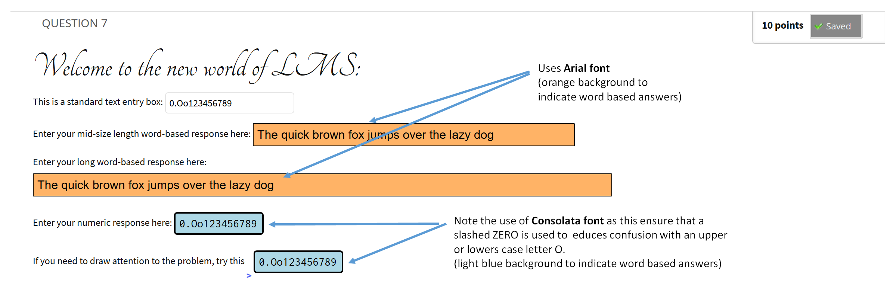
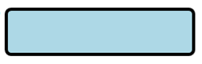
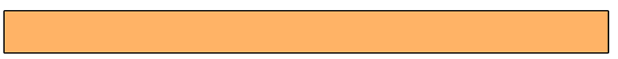
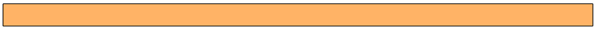
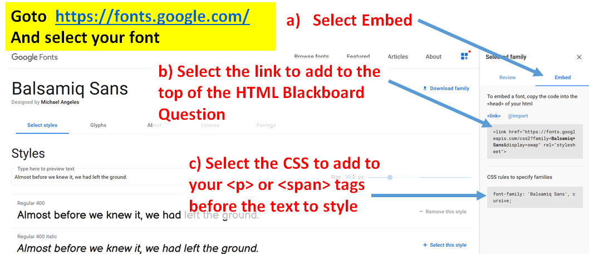

# Blackboard CSS
 ### Improving the look, feel and functionality of the Blackboard Learning Management System through CSS style sheets
## QuickStart
If you just want to jump ahead and view these on a brower to see the effects, try these links to [Q6](http://htmlpreview.github.io/?https://github.com/HikariBoy/Blackboard-CSS/blob/master/Q6_BrowserView.html) and [Q7](http://htmlpreview.github.io/?https://github.com/HikariBoy/Blackboard-CSS/blob/master/Q7_BrowserView.html) (these which should not be used in an Blackboard question, see files provided later in page).  Take note of the animation in [Q7](http://htmlpreview.github.io/?https://github.com/HikariBoy/Blackboard-CSS/blob/master/Q7_BrowserView.html) which is now also possible in Blackboard using the the new [AdrianStyle.css](AdrianStyle.css) sheet.  I have made a short video (click image right) to explain the added functionality.   
To use in Blackboard, [read the long version](#Usage) or if you know what you are doing, just download (clone) this page, and then extract the .ZIP file where you will find the styles sheet and example .txt files (in HTML) to try in your Blackboard Questions.  To explore the new styles, upload the stylesheet file [AdrianStyle.css](Adrianstyle.css) into the content collection of your unit. Once done, the new functions are ready to use. For more details see [below](#Features):

## Motivation
 
 I've seen students, most likely panicking  and short of time, enter O and o (upper and lower case O) for a zero on an LMS number based problem - this makes it hard to grade, athough I've also developed an [automated grading system called Medusa](https://github.com/HikariBoy/Medusa) that does a better job than Blackboard does, but that's a [different page](https://github.com/HikariBoy/Medusa).  I set out to enhance Blackboard's features to add features which, amoungst other things, would help students to avoid this mistake (for example a [slashed-Zero](https://excel.tips.net/T003835_Using_Slashed_Zeroes.html) font would help).  This work looks to improve the look and feel of blackboard specifically for engineering/science based units through the use of improved text entry boxes.  This work was undertaken at the [The University of Western Australia](https://research-repository.uwa.edu.au/en/persons/adrian-keating)  with the aim to improve the overall on-line learning experience. 
Text (or number) based entry boxes are used extensively in [<b>Fill in Multiple Blanks Questions </b>](https://help.blackboard.com/Learn/Instructor/Tests_Pools_Surveys/Question_Types/Fill_in_Multiple_Blanks_Questions) in Blackboard.  These type of questions have been explored previous in another one of my [github pages which describes their value in forming more detailed, long-answer type](https://github.com/HikariBoy/BlackBoard-Multipart-Questions) questions in Blackboard.  Such question styles are required, especially towards the end of a unit, in order for
 students apply, analyse, synthesize and evaluate [(Levels 3-6 of Bloom’s Taxonomy)](https://learningcenter.unc.edu/tips-and-tools/higher-order-thinking/)  
## Usage
 > Note: the features provided here can enhance the display of information, but does need a basic understanding of HTML. 

 The improvements here are obtained throug the use of a [external CSS stylesheet](https://www.w3schools.com/css/css_howto.asp) sheet which needs to be added to the content collection for the particular unit of interest. To start, download this github by clicking on the green <b>clone</b> button at the top right of this github and selecting download.  After downloading, extract the .ZIP file where you will find the styles sheet and example .txt files (in HTML) to try in your Blackboard Questions. 
To explore the new styles, upload the file [AdrianStyle.css](AdrianStyle.css) into the [content collection of your unit](https://help.blackboard.com/Learn/Student/Content/Content_Collection).  Once done, the new functions are ready to use.  
### Features
The new entry styles for  [<b>Fill in Multiple Blanks Questions </b>](https://help.blackboard.com/Learn/Instructor/Tests_Pools_Surveys/Question_Types/Fill_in_Multiple_Blanks_Questions)  are:
* For number based question.  A new text entry box is created with the following features
   * distintly different display from the traditional Blackboard white entry box with light bounding box
   * light blue background with rounded
   * thicker bounding box
   * changed to 16pt Consolata which uses a <b>[slashed-Zero](https://excel.tips.net/T003835_Using_Slashed_Zeroes.html) to avoid confusion with upper or lower case letter O</b>.
   * shorter length entry box to consume less display area
* For word or sentence  based question.  A new text entry box is created with the following features:
   *  distintly different display from the traditional Blackboard white entry box with light bounding box
   * orange background with square edges
   * Set to 16pt Arial font, so typically larger than default Blackboard text.
   * Two stypes of entry boxes available, one that take 50% of the horizontal screen width and the other takes 90%, so both are considerably longer than teh number based entry bbox_inches  

 A comparison of the different entry boxes styles is shown below. 
   <figcaption >  <I><b>Figure 1: </b></I>  Illustration of a typical and improved LMS question style.  Use of styled fonts for heading can imporve appeal, orange entryboxes are used to indicated word based entry is required, while light-blue entry boxes indicate numberic (with or without units) are required. 

When using [Fill in Multiple Blanks Questions](https://help.blackboard.com/Learn/Instructor/Tests_Pools_Surveys/Question_Types/Fill_in_Multiple_Blanks_Questions), type the question text as students will see it, but replace the missing information with variables in square brackets. Bracketed variables appear as text boxes to students. Variables for [Fill in Multiple Blanks Questions](https://help.blackboard.com/Learn/Instructor/Tests_Pools_Surveys/Question_Types/Fill_in_Multiple_Blanks_Questions) can be any (unique) letter or word.
For example 
 <code>Enter your numeric response here: [num1] </code> 
to use the new number style entry box simple add the \ tag and include my new class <code>AdrianNumberBox</code> (using the HTML entry format on LMS) 
 <code>\ Enter your numeric response here: [num1] \</code> 
 Results in (only when displayed in a Blackboard deployed question)   
<code> Enter your numeric response here:</code>  
To use the new sentence style with a 50% wide style entry box, simply add the \ tag and include my new class <code>AdrianSentenceBox</code>  (using the HTML entry format on LMS) 
<code>\ Enter your numeric response here: [num1] \</code>   
Results in (only when displayed in a Blackboard deployed question) 
<code> Enter your numeric response here:</code>    
 To use the new sentence style with a 90% wide entry box, simply add the \ tag and include my new class <code>AdrianNumberSentence90</code> (using the HTML entry format on LMS) 
 <code>\ Enter your numeric response here: [num1] \</code> 
 Results in (only when displayed in a Blackboard deployed question) 
 <code> Enter your numeric response here:</code>     
 I have included sample HTML code for [Q6](Q6_HTML.txt) and [Q7](Q7_HTML.txt) that you can cut and paste into the HTML entry of a [Fill in Multiple Blanks Question](https://help.blackboard.com/Learn/Instructor/Tests_Pools_Surveys/Question_Types/Fill_in_Multiple_Blanks_Questions).  If you just want to view these on a brower to see the effect, try these links to [Q6](http://htmlpreview.github.io/?https://github.com/HikariBoy/Blackboard-CSS/blob/master/Q6_BrowserView.html) and [Q7](http://htmlpreview.github.io/?https://github.com/HikariBoy/Blackboard-CSS/blob/master/Q7_BrowserView.html) (which should not be used in an Blackboard question).  Take note of the animation in [Q7](http://htmlpreview.github.io/?https://github.com/HikariBoy/Blackboard-CSS/blob/master/Q7_BrowserView.html) which is now also possible in Blackboard using the the new [AdrianStyle.css](Adrianstyle.css) sheet
## New Fonts in BlackBoard
Interested in adding new fonts to the standard Blackboard interface ?  To do this you need to add a link to a new font and reference it within a tag (\
 or \) for example:  
<code> \<link href="https://fonts.googleapis.com/css2?family=Balsamiq+Sans&display=swap" rel="stylesheet">
\
 Welcome to the new world of LMS\
</code>
To achieve this:  
1) select your font.  Go to https://fonts.google.com/  and review the fonts and decide on one  
2) select the font and then select <b>Embed</b> Menu item on the right side of screen.  This contains the link to use in the top of the LMS question and the CSS style to use in the HTL tag (as shown in the example above)
   <figcaption >  <I><b>Figure 2: </b></I>   Instructions on how to select a new Google font for your Blackboard page.   

3) Copy the<b>Link</b> (which starts with <code> \<link href="https://fonts.googleapis.com....</code> and add to the to pof the HTML page of your Blackboard question 
4) Copy the <b>CSS</b> (which starts with <code> font-family: </code> and use this just before the text you want to change the font of for example  
<code>  \
 Welcome to the new world of LMS\
 </code> 
5) Note the the fonts will not be viewable until you save the question and view the Question in a regular deployed test.  If you want to try out what it will look like before adding to LMS, you can paste you Blackboard HTML code into an [code viewing fiddle](http://jsfiddle.net)
